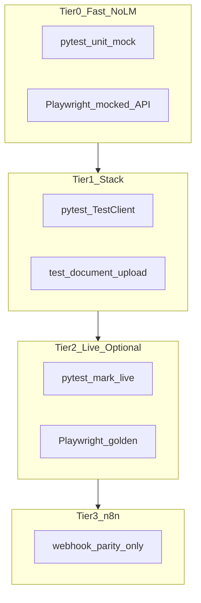
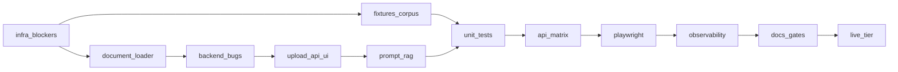

# پلن نهایی — ابرتست و ضدگلوله‌سازی PMO AI System

## اصول طراحی (ثابت)

1. **UI با mock API** تست می‌شود (پایدار، بدون LM)؛ کیفیت LLM فقط در tier `@golden` با oracle **ساختاری** (نه متن دقیق).
2. **Import اسناد** در PMO = parse/chunk/embed/Qdrant (مسیر فعلی gateway)؛ LM Studio فقط `/v1/embeddings` + `/v1/chat/completions` — [بدون API آپلود سند پایدار](https://lmstudio.ai/docs/app/basics/rag).
3. **فرمت‌ها و محدودیت‌ها** با LM Studio native هم‌تراز: `.pdf`, `.docx`, `.txt` + plain-text fallback.
4. **هر endpoint جدید** auth یکسان: header `X-PMO-Token` = `WEBHOOK_SECRET`.
5. **هیچ assert روی متن دقیق LLM** در CI — فقط schema، status، UI state.

---

## ممیزی پلن — تناقض‌ها و باگ‌های کشف‌شده (رفع در اجرا)

| # | مشکل | شواهد کد | رفع در پلن |
|---|------|----------|------------|
| 1 | **آپلود imposible** — volume فقط خواندنی | [`docker-compose.yml`](docker-compose.yml) L60: `pmo_docs:/data/pmo_docs:ro` | تغییر به `:rw` در `infra-blockers` |
| 2 | **free_prompt-only → failed (HTTP 200)** | UI OK ([`app.js`](services/pmo-ui/static/js/app.js) L421)؛ backend رد ([`pmo_service.py`](services/lmstudio-gateway/pmo_service.py) L122) — `{status:failed}` نه 400 | `backend-bugs`: validation شامل `free_prompt` |
| 3 | **تناقض ۱۰۰ vs ۱۰ فایل** در متن قبلی | env `PMO_MAX_FILES_PER_UPLOAD=10` | یکسان: **حداکثر ۱۰ فایل** per batch |
| 4 | **chat خالی → HTTP متفاوت** | stream: 400 ([`main.py`](services/lmstudio-gateway/main.py) L200)؛ non-stream: 200 + `{status:failed}` | ماتریس تست هر دو رفتار را جدا assert کند |
| 5 | **risk فقط `.txt`** | [`read_text_files`](services/lmstudio-gateway/rag.py) L176 | risk reports از `document_loader` بعد از ingest گسترش |
| 6 | **ingest orphan vectors** | re-ingest upsert می‌کند؛ حذف فایل → points باقی | full ingest: حذف points با `source` غیرموجود؛ delete API: Qdrant filter |
| 7 | **n8n ≠ upload API** | workflows فقط webhook ingest/letter/risk | parity فقط برای `/webhook/pmo/*`؛ upload **gateway-only** |
| 8 | **pytest مسیر نامشخص** | gateway در `services/lmstudio-gateway/` | `tests/` در **ریشه repo** + `conftest` اضافه gateway به `sys.path` |
| 9 | **ACCEPTANCE #30** «Risk empty → failed» | با `context` در body باید OK شود | به‌روز checklist: failed فقط وقتی reports **و** context خالی |
| 10 | **Playwright tour** auto-start 800ms | [`app.js`](services/pmo-ui/static/js/app.js) | `beforeEach`: `localStorage.pmo_tour_done=1` مگر تست tour |
| 11 | **FastAPI upload** بدون `python-multipart` | [`requirements.txt`](services/lmstudio-gateway/requirements.txt) فقط 4 dep | اضافه در `infra-blockers` |
| 12 | **UI rebuild** بعد از تغییر HTML/JS | [`pmo-ui/Dockerfile`](services/pmo-ui/Dockerfile) — nginx static | `docker compose build pmo-ui` در runbook تست |
| 13 | **embed v2 ممکن است 400** | [`docs/ARTICLE_APPENDIX.md`](docs/ARTICLE_APPENDIX.md) L35 | runbook: fallback v1.5؛ تست live embed قبل از ingest |
| 14 | **`_clean_text` تهاجمی** | [`rag.py`](services/lmstudio-gateway/rag.py) L34 — حذف نماد/عدد خارج FA+ASCII | در `document_loader`: clean ملایم‌تر برای L1 یا flag `PMO_STRICT_CLEAN` |
| 15 | **fixtures قبل از unit tests** | ترتیب قبلی: fixtures بعد از upload | fixtures موازی با `document-loader` |
| 16 | **`.gitignore` docx/pdf در pmo_docs** | [`.gitignore`](.gitignore) L4–5 — `pmo_docs/**/*.pdf/docx` ignore | فیکسچر binary در `tests/fixtures/`؛ copy به `pmo_docs` در runtime؛ `.pmo_index.json` ignore |
| 17 | **UI فقط `PMO.post` JSON** | [`app.js`](services/pmo-ui/static/js/app.js) L56 — بدون FormData | `PMO.uploadFiles()` جدید بدون `Content-Type: application/json` |
| 18 | **`preflight.ps1` اجبار LM Studio** | L22–28 همیشه LM را چک می‌کند | `run_all_tests`: tier0 با `-SkipLM` یا preflight سبک docker-only |
| 19 | **Point ID migration Qdrant** | ID فعلی `source:idx:text` | اول deploy با ingest جدید: `PMO_RAG_RESET=true` یک‌بار یا orphan cleanup |
| 20 | **envهای PMO_* در compose** | فقط در جدول پلن — [`docker-compose.yml`](docker-compose.yml) فعلاً ندارد | propagate env vars به service `lmstudio-gateway` |

**nginx:** `client_max_body_size 50m` ([`nginx.conf`](services/nginx/nginx.conf) L7) — برای 30MB کافی است؛ نیاز به تغییر ندارد.

**gitignore:** `pmo_docs/.pmo_index.json` — sidecar runtime؛ commit نشود.

---

## وضعیت فعلی (شکاف‌ها)

| بخش | وضعیت |
|------|--------|
| تست خودکار | [`scripts/test_gateway.ps1`](scripts/test_gateway.ps1)، [`scripts/run_poc.ps1`](scripts/run_poc.ps1) — بدون pytest/Playwright |
| Corpus | ۲ فایل `.txt` در [`pmo_docs/`](pmo_docs/) |
| Ingest | فقط `.txt`؛ [`rag.py`](services/lmstudio-gateway/rag.py) `rglob("*.txt")` |
| Import UI | فقط راهنمای کپی دستی — [`index.html`](services/pmo-ui/templates/index.html) L231 |
| پرامپت‌ها | `ERROR_NO_DOCS` + `<\|think\|>` در [`scenario_a_legal.txt`](config/prompts/scenario_a_legal.txt) / [`scenario_b_risk.txt`](config/prompts/scenario_b_risk.txt) |
| Config | [`config.py`](services/lmstudio-gateway/config.py) — بدون envهای upload/RAG/chunk |
| Acceptance | [`docs/ACCEPTANCE_CHECKLIST.md`](docs/ACCEPTANCE_CHECKLIST.md) — UI قدیمی، gateها PASS نشده |

---

## بلوک A — پیش‌نیاز infra (قبل از upload)

### A.1 docker-compose

```yaml
# قبل: :ro  — بعد:
- ./pmo_docs:/data/pmo_docs:rw
```

Envهای جدید در `lmstudio-gateway` — **هم در [`config.py`](services/lmstudio-gateway/config.py) هم در [`docker-compose.yml`](docker-compose.yml) `environment:`**:

| Env | پیش‌فرض | نقش |
|-----|---------|-----|
| `PMO_MAX_UPLOAD_MB` | 30 | هم‌تراز LM Studio PDF/docx |
| `PMO_MAX_FILES_PER_UPLOAD` | 10 | batch upload |
| `PMO_UPLOAD_AUTO_INGEST` | true | بعد از upload فوری index |
| `PMO_RAG_RESET` | false | recreate collection |
| `PMO_RAG_MIN_SCORE` | 0.35 | threshold similarity |
| `PMO_CHUNK_SIZE` | 1000 | char (فعلی) |
| `PMO_CHUNK_OVERLAP` | 200 | char (فعلی) |

### A.2 Dockerfile gateway

کپی `document_loader.py` در [`Dockerfile`](services/lmstudio-gateway/Dockerfile) L12؛ اضافه `pypdf` و **`python-multipart`** به [`requirements.txt`](services/lmstudio-gateway/requirements.txt).

### A.3 Sidecar manifest (برای list وقتی Qdrant down)

`pmo_docs/.pmo_index.json`: `{files: [{name, format, size, hash, chunks, ingested_at, status}]}` — به‌روز در upload/ingest/delete.

---

## بلوک B — Import اسناد (هم‌راستا با LM Studio)

### B.1 مرجع تحقیق

| منبع | نتیجه |
|------|--------|
| [LM Studio RAG docs](https://lmstudio.ai/docs/app/basics/rag) | Native: `.pdf`, `.docx`, `.txt` |
| [LM Studio 0.3.0](https://lmstudio.ai/blog/lmstudio-v0.3.0) | Max ~30MB PDF/docx؛ سایر پسوندها plain text |
| [Embedding API](https://lmstudio.ai/docs/python/embedding) | Ingest برنامه‌نویسی = `/v1/embeddings` |
| [AnythingLLM](https://docs.useanything.com/setup/embedder-configuration/local/lmstudio) | embed **یا** LLM همزمان روی یک server instance — runbook دستی |
| [Qdrant delete by filter](https://qdrant.tech/documentation/concepts/points/#delete-points) | `POST .../points/delete` + `filter.must key=source` |

### B.2 ماتریس فرمت

| Tier | پسوند | رفتار |
|------|--------|--------|
| **L1** | `.txt`, `.docx`, `.pdf` | extract + ingest (اجباری) |
| **L2** | `.md`, `.csv`, `.json`, `.log`, `.text` | UTF-8 plain |
| **L3** | watch list: `.html`, `.epub`, OCR | خارج از scope فاز ۱ |
| **رد** | `.exe`, `.zip`, encrypted | رد per-file در response (batch همچنان 200)؛ multipart نامعتبر → 400 |

**محدودیت‌ها:** 30MB/file، 10 files/batch، <10 char بعد از clean → skip (در response گزارش).

### B.3 API (همه با `X-PMO-Token`)

| Endpoint | Method | رفتار |
|----------|--------|--------|
| `POST /api/pmo/documents/upload` | multipart | validate → save `pmo_docs/` (sanitize name) → optional ingest → per-file result |
| `GET /api/pmo/documents/list` | GET | از manifest + merge Qdrant chunk counts |
| `DELETE /api/pmo/documents/{name}` | DELETE | حذف فایل + Qdrant delete filter `source==name` |
| `POST /api/pmo/ingest` | POST | re-index کل پوشه + **orphan cleanup** |

**Response upload (نمونه):**

```json
{
  "status": "success",
  "saved": 2,
  "skipped": 1,
  "ingested_chunks": 45,
  "files": [
    {"name": "a.pdf", "status": "indexed", "chunks": 12},
    {"name": "b.exe", "status": "rejected", "reason": "فرمت پشتیبانی نمی‌شود"}
  ]
}
```

### B.4 UI — تب «پایگاه اسناد»

فایل‌ها: [`index.html`](services/pmo-ui/templates/index.html), [`app.js`](services/pmo-ui/static/js/app.js), [`app.css`](services/pmo-ui/static/css/app.css).

1. Drop zone + `input[type=file][multiple]` با `accept` L1+L2
2. Badge: «PDF · Word · Text · Markdown — حداکثر ۳۰MB»
3. جدول اسناد از `GET /api/pmo/documents/list`
4. دکمه‌ها: آپلود، به‌روزرسانی همه (ingest)، حذف per row
5. Progress + toast per-file
6. کارت runbook: «قبل از ingest مدل embedding در LM Studio Load باشد»
7. **`PMO.uploadFiles(path, files)`** — `FormData` + `fetch` بدون header JSON (جدید در [`app.js`](services/pmo-ui/static/js/app.js))

### B.5 Runbook — [`docs/DOCUMENT_IMPORT.md`](docs/DOCUMENT_IMPORT.md)

1. Load `nomic-embed-text-v2` (fallback v1.5 در gateway)
2. Start Server → ingest/upload
3. برای chat/letter/risk: Unload embed → Load LLM (`gemma-...`)
4. Batch embed: تا ~۲۰ `input` در یک `/v1/embeddings` (بهینه‌سازی؛ Qdrant upsert batch=32 جدا)
5. Troubleshooting فارسی در status card

---

## بلوک C — Backend ingest/RAG

### C.1 [`document_loader.py`](services/lmstudio-gateway/document_loader.py) (جدید)

- `extract_text(path) -> tuple[str, str]` (text, format)
- `normalize_persian(text)` — ZWNJ، diacritic سبک (بدون hazm در فاز ۱)
- `is_supported(path) -> bool`
- PDF: `pypdf` text-layer؛ scan-only → empty + reason

### C.2 Refactor [`rag.py`](services/lmstudio-gateway/rag.py)

| تغییر | جزئیات |
|--------|--------|
| `read_documents` | جایگزین `read_text_files`؛ L1+L2 recursive |
| Point ID | `uuid5(NAMESPACE_URL, f"{file_hash}:{chunk_idx}")` — پایدار برای incremental |
| Payload | `{text, source, path, format, file_hash, ingested_at}` |
| `embed_texts` | batch تا 20 متن per request (loop fallback) |
| `delete_by_source` | Qdrant `POST .../points/delete` filter |
| `ingest_directory` | skip unchanged hash؛ orphan cleanup؛ partial success reporting |
| `search` | filter hits با `score >= PMO_RAG_MIN_SCORE` |

### C.3 [`pmo_service.py`](services/lmstudio-gateway/pmo_service.py)

- `_sanitize_model_output()` — strip think tags، تبدیل ERROR_NO_DOCS
- `pmo_letter`: validation شامل `free_prompt`؛ بدون fail وقتی RAG خالی
- `pmo_risk`: `read_documents` برای weekly_reports
- `prepare_chat_messages`: load [`chat_system.txt`](config/prompts/chat_system.txt)؛ اگر RAG فعال و hit ضعیف/خالی → suffix صریح «سند مرتبط یافت نشد»

---

## بلوک D — پرامپت‌ها

| فایل | تغییر |
|------|--------|
| `chat_system.txt` | system پیش‌فرض PMO فارسی |
| `scenario_a_legal.txt` | حذف ERROR_NO_DOCS اجباری و think؛ استفاده از فیلدهای کاربر |
| `scenario_b_risk.txt` | JSON schema صریح؛ empty → `project_risks: []` |

---

## بلوک E — هرم تست



### E.1 ساختار `tests/` (ریشه repo)

```
tests/
  conftest.py           # sys.path → services/lmstudio-gateway؛ mock lm_post؛ tmp_docs
  pytest.ini            # markers: live, golden
  unit/
    test_rag.py
    test_pmo_service.py
    test_document_loader.py
  integration/
    test_api_matrix.py
    test_document_upload.py
    test_n8n_parity.py
  fixtures/documents/ ...
  fixtures/expected/risk_schema.json, annotated_risks.json
  playwright/
    playwright.config.ts  # baseURL localhost:8080, locale fa-IR
    package.json
    specs/tab-*.spec.ts, cross-cutting.spec.ts
```

**Deps:** `pytest`, `pytest-asyncio`, `httpx`, `respx`, `pypdf` (dev) در gateway requirements-dev یا root `requirements-test.txt`.

**[`scripts/run_all_tests.ps1`](scripts/run_all_tests.ps1):**

1. `preflight.ps1 -SkipLM` (یا flag معادل — فقط Docker + workflow JSON)
2. `docker compose up -d --build` (if not up)
3. `pytest tests/unit tests/integration -m "not live"` — `$env:PYTHONPATH=services/lmstudio-gateway`؛ `PMO_DOCS_PATH` → tmp در conftest
4. `cd tests/playwright && npx playwright test` (mock routes)
5. if LM up (`preflight.ps1` full): `pytest -m live` + `playwright --grep @golden`
6. write [`docs/test_matrix.md`](docs/test_matrix.md)

---

## بلوک F — ماتریس تست اتمیک

### F.1 Unit (mock)

**rag:** chunk/clean/embed fallback/search empty/ingest missing dir/skip short/delete filter/orphan cleanup  
**pmo_service:** chat empty، letter free-only، letter no fields، risk JSON parse، sanitize think  
**document_loader:** txt/docx/pdf/md/corrupt/scan-pdf/30MB boundary

### F.2 API — قرارداد HTTP واقعی

| Endpoint | OK | Auth | Invalid | Edge |
|----------|-----|------|---------|------|
| `GET /health` | 200 | — | — | LM down: degraded |
| `GET /api/pmo/status` | 200 | — | — | fields جدید documents |
| `POST /api/pmo/chat` | 200 success | 401 | 200 failed empty prompt | use_rag |
| `POST /api/pmo/chat/stream` | SSE | 401 | **400** empty prompt | error event |
| `POST /api/pmo/letter` | 200 | 401 | 200 failed | free_prompt only |
| `POST /api/pmo/letter/docx` | bytes | 401 | 400 empty | RTL content |
| `POST /api/pmo/risk/run` | 200 JSON | 401 | 200 failed no input | context only |
| `POST /api/pmo/ingest` | 200 | 401 | 200 failed empty | mixed formats |
| `POST /api/pmo/documents/upload` | 200 partial OK | 401 | 413 oversize | 10 file limit |
| `GET /api/pmo/documents/list` | 200 | 401 | — | empty manifest |
| `DELETE /api/pmo/documents/{name}` | 200 | 401 | 404 | Qdrant filter |
| n8n `/webhook/pmo/*` | parity | 401 | — | n8n down 502 |

**n8n parity scope:** ingest, letter, risk webhooks فقط — **نه** upload API.

### F.3 Playwright — ۵ تب + cross-cutting

**Setup:** `page.addInitScript(() => localStorage.setItem('pmo_tour_done','1'))`؛ mock `**/api/pmo/**`؛ upload endpoint جدا mock multipart.

| Tab | Cases کلیدی |
|-----|-------------|
| Chat | empty err، chip، stream/stop، copy، bad token، RAG checkbox in body |
| Letter | validation، free-only، docx download، API fail |
| Risk | empty/context، table/hint، view HTML |
| Docs | upload، drag-drop، oversize، delete، ingest، LM hint |
| Settings | status، token، theme، tour (spec جدا)، n8n webhooks، help modal |
| Cross | hash `#ingest`→docs، `#n8n`→settings، RTL، readiness chip |

**Live `@golden`:** 1 scenario/tab؛ timeout letter/risk 300s؛ **no assert exact LLM text**.

### F.4 Fixtures [`tests/fixtures/documents/`](tests/fixtures/documents/)

| فایل | هدف |
|------|-----|
| `contract_full_fa.txt` | بند تأخیر، جریمه |
| `contract_mixed_fa_en.txt` | encoding |
| `weekly_report_*.txt` ×3 | risk oracle |
| `empty.txt`, `corrupt_binary.txt`, `large_50kb.txt` | edge |
| `contract_clause.docx`, `weekly_report.docx` | L1 |
| `contract_summary.pdf`, `scan_only.pdf` | text-layer / skip |
| `sample.md` | L2 |
| `invalid.docx` | corrupt skip |

Oracle: [`annotated_risks.json`](tests/fixtures/expected/annotated_risks.json) — ≥3 risks با severity enum.

---

## بلوک G — RAG فارسی و پایداری (تکمیلی)

| موضوع | اقدام |
|--------|--------|
| Chunk A/B | env `PMO_CHUNK_SIZE/OVERLAP`؛ benchmark 1000/200 vs 1500/225 (~512 token FA) |
| Similarity guard | `PMO_RAG_MIN_SCORE` + پیام UI |
| Concurrent upload+ingest | asyncio lock در gateway |
| Path traversal | `Path(name).name` only |
| LM down on upload | save file؛ manifest `status: pending_ingest` |
| Qdrant down | save OK؛ ingest fail toast |
| Playwright a11y | `aria-label` drop zone؛ RTL table |
| Watch list | hybrid BM25، OCR FA، LM Studio v1 retrieval API |

---

## بلوک H — Docs و Gates

| Artifact | محتوا |
|----------|--------|
| [`docs/test_matrix.md`](docs/test_matrix.md) | 120+ case، PASS/FAIL صادقانه |
| [`docs/DOCUMENT_IMPORT.md`](docs/DOCUMENT_IMPORT.md) | فرمت‌ها، runbook، troubleshooting |
| [`docs/ACCEPTANCE_CHECKLIST.md`](docs/ACCEPTANCE_CHECKLIST.md) | ۵ تب، upload، stream، Playwright، items 31–35 بازنویسی، #30 اصلاح |
| [`scripts/run_poc.ps1`](scripts/run_poc.ps1) | + chat/stream/upload smoke |
| [`scripts/benchmark_pmo.py`](scripts/benchmark_pmo.py) | upload→search latency |
| [`scripts/sync_n8n_secret.ps1`](scripts/sync_n8n_secret.ps1) | sync token workflows ↔ `.env` |

---

## Definition of Done

1. `pytest -m "not live"` → 100% pass بدون LM Studio
2. `playwright test` (mocked) → ۵ تب + upload + cross-cutting pass
3. upload txt/docx/pdf → manifest + Qdrant metadata کامل
4. `free_prompt`-only letter → 200 success (backend fix)
5. docker `pmo_docs` writable؛ ingest/delete بدون crash
6. پرامپت mock بدون think leak
7. `-m live` optional → upload→ingest→chat RAG `@golden` PASS
8. LM/Qdrant/n8n down → graceful degradation documented + tested
9. `docs/test_matrix.md` پر شده

---

## ترتیب اجرا (وابستگی)



**تخمین:** ~۴۰ فایل جدید/ویرایش؛ بحرانی‌ترین مسیر: `infra-blockers` → `document-loader` → `doc-import-ui-api`.

---

## ثبت ریسک

| ریسک | احتمال | کاهش |
|------|--------|------|
| LM Studio model swap دستی گیج‌کننده | بالا | runbook + status card embed vs LLM |
| PDF فارسی RTL extract ناقص | متوسط | fixture + skip message |
| ingest کند روی corpus بزرگ | متوسط | incremental hash + batch embed |
| Playwright flaky tour | متوسط | localStorage skip default |
| n8n token drift | متوسط | sync script + test 401 |
| nomic-embed v2 HTTP 400 | متوسط | fallback v1.5 در rag.py + preflight embed smoke |
| `_clean_text` حذف اعداد/نماد قرارداد | متوسط | clean ملایم در document_loader |

---

## چک اتمیک نهایی — verdict (rev.2)

### ماتریس ۵ تب × پوشش پلن

| Tab | UI IDs | API فعلی | API جدید | Unit | API test | Playwright | Live |
|-----|--------|----------|----------|------|----------|------------|------|
| Chat | `panel-chat`, `chatPrompt`, `chatStream` | `/chat`, `/chat/stream` | — | mock LM | matrix | tab-chat | @golden |
| Letter | `panel-letter`, `letterFree` | `/letter`, `/letter/docx` | — | free-only bug | matrix | tab-letter | @golden |
| Risk | `panel-risk`, `riskContext` | `/risk/run` | — | JSON parse | matrix | tab-risk | @golden |
| Docs | `panel-docs`, `btnIngest` | `/ingest` | `/documents/*` | loader | upload | tab-docs | upload→RAG |
| Settings | `panel-settings`, n8n btns | `/status`, webhooks | status+docs fields | — | n8n parity | tab-settings | optional |

### ماتریس ۱۲ todo × بلوک

| Todo | بلوک | وابستگی | blocker |
|------|------|---------|---------|
| infra-blockers | A | — | **بله — اول** |
| document-loader | C | infra | بله |
| backend-bugs | C | document-loader | خیر |
| doc-import-ui-api | B | loader + infra rw | بله |
| fixtures-corpus | F | — | موازی |
| test-infra | E | — | موازی |
| unit-tests | F | fixtures + loader | خیر |
| prompt-rag-fix | D | — | موازی |
| api-matrix | F | unit + upload API | خیر |
| playwright-tabs | F | UI + mock | خیر |
| ingest-observability | G | loader | خیر |
| docs-gates | H | همه | آخر |

### معیارهای PASS (rev.2)

| معیار | وضعیت |
|--------|--------|
| 20 مورد ممیزی مستند | PASS |
| تناقض داخلی | PASS — B.2 batch vs 400، gitignore، preflight |
| ۵ تب fully mapped | PASS |
| 12 todo بدون orphan | PASS |
| HTTP contract vs کد | PASS — chat stream/non-stream جدا |
| آماده اجرا | **بله** |

**خارج از scope فاز ۱:** L3 HTML/EPUB/OCR، BM25، LM retrieval API، Postgres n8n، آپلود به subfolder `weekly_reports/` (فاز ۱: flat `pmo_docs/` only).

**اولین ۳ گام اجرا:** (1) infra-blockers + preflight `-SkipLM` (2) document_loader + rag + `PMO_RAG_RESET` doc (3) upload API + `PMO.uploadFiles` + UI docs tab.
