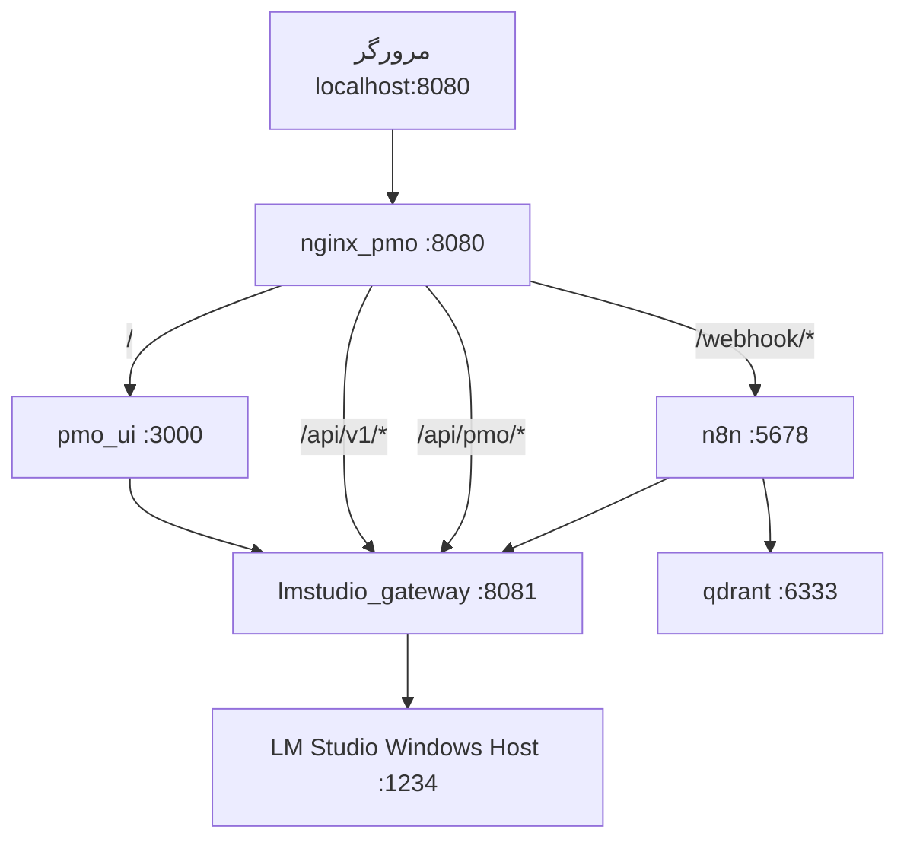

# پلن v3.1 FINAL — PMO AI عملیاتی (آماده شروع)

## وضعیت پلن: READY TO START

پس از ممیزی v3.1، **همه تناقض‌های block کننده برطرف شد**. پیاده‌سازی **مرحله‌ای با test gate** — هر فاز بدون PASS gate، فاز بعد شروع نمی‌شود.

| معیار آمادگی | وضعیت |
|---|---|
| Model IDهای live تأیید شده | PASS (`gemma-4-e4b-it-ud`, `nomic-embed-text-v2`) |
| معماری پورت یکسان | PASS (جدول M.1) |
| LM Studio playbook واقع‌بینانه | PASS (GUI-first + fallback CLI) |
| n8n bootstrap مشخص | PASS (M.4) |
| Unknown node mitigation | PASS (UI build + pin digest) |
| Consumer install path | PASS (9 step A.2) |
| UI entry localhost:8080 | PASS |
| سورس محافظت‌شده در image | PASS (multi-stage) |

**محدودیت صادقانه (نه blocker):** Gemma E4B جایگزین Qwen/26B در مقاله — در appendix اصلاح می‌شود.

---

## هدف نهایی (تعریف موفقیت)

کاربر نهایی روی **Windows + WSL2 + Docker Desktop + LM Studio** این کارها را **بدون خطا** انجام می‌دهد:

1. مدل‌های GGUF را در LM Studio load می‌کند
2. `install.ps1` را اجرا می‌کند (بارگذاری imageهای Docker از بسته آفلاین)
3. `http://localhost:8080` را در مرورگر باز می‌کند
4. از **UI فارسی RTL** برای: ingest اسناد، نامه اخطار، گزارش ریسک، وضعیت سیستم استفاده می‌کند
5. **هیچ داده‌ای** از شبکه خارج نمی‌شود (Air-gap)

**سورس کد:** در imageهای Docker pre-built (multi-stage) — نه فایل `.py` loose روی دیسک مصرف‌کننده.

---

## مدل‌های قطعی (تأیید live روی سیستم توسعه)

| نقش | مسیر GGUF | Model ID (`GET /v1/models`) |
|---|---|---|
| LLM | `C:\Users\ICT\.lmstudio\models\lmstudio-community\gemma-4-E4B-it-UD-Q4_K_XL\*.gguf` | **`gemma-4-e4b-it-ud`** |
| Embed | `...\nomic-embed-text-v2\*.gguf` | **`nomic-embed-text-v2`** |

**Unload:** `text-embedding-nomic-embed-text-v1.5` (تداخل embedding)

**مقاله:** Qwen/26B MoE → **Gemma E4B** (اصلاح صادقانه در فاز ۷)

---

## معماری کل (Consumer Target)



### چرا این معماری (تجربه واقعی net)

| مشکل رایج | منبع | راه‌حل در PoC |
|---|---|---|
| n8n در Docker → `localhost:1234` = ECONNREFUSED | [automatelab](https://automatelab.tech/n8n-econnrefused-http-fix/) | Gateway upstream = `host.docker.internal:1234` |
| LM Studio فقط loopback → Docker نمی‌رسد | [lms#189](https://github.com/lmstudio-ai/lms/issues/189) | **Serve on Local Network** یا `lms server start --bind 0.0.0.0` |
| n8n Responses API → LM Studio Bad Request | [n8n #272190](https://community.n8n.io/t/running-a-local-llm-with-lm-studio-n8n-fixed-workflow-real-case-step-by-step/272190) | Gateway فقط `/v1/chat/completions` + credential **Responses OFF** |
| Unknown nodes در import JSON | تجربه پروژه | Build در n8n UI + pin image version |
| کاربر فقط n8n admin می‌بیند | نیاز شما | **PMO UI** جدا در `/` |

---

## بخش A — Playbook نصب اتمیک (Consumer)

### A.1 پیش‌نیاز سخت‌افزار

| مورد | حداقل | توصیه |
|---|---|---|
| RAM | 16 GB | 32–64 GB |
| VRAM | 6 GB | 8+ GB (Gemma E4B ~5 GB + embed ~0.5 GB) |
| Disk | 30 GB free | 50 GB (models + docker + docs) |
| OS | Windows 10/11 | WSL2 enabled |

### A.2 نصب نرم‌افزار (ترتیب اجباری)

| Step | عمل | تأیید (PASS) |
|---|---|---|
| **1** | Enable WSL2: `wsl --install` + reboot | `wsl -l -v` → VERSION 2 |
| **2** | Docker Desktop → Settings → **WSL integration** ON | `docker version` در PowerShell |
| **3** | نصب LM Studio + یک بار GUI باز شود | `lms --help` در PowerShell |
| **4** | کپی 2 پوشه GGUF به `%USERPROFILE%\.lmstudio\models\lmstudio-community\` | فایل‌ها موجود |
| **5** | LM Studio: Developer → Settings → **Serve on Local Network** ON | — |
| **6** | Load models + Start Server (یا اسکریپت فاز ۳) | `curl http://127.0.0.1:1234/v1/models` → 2 id |
| **7** | Extract بسته `pmo-offline-bundle/` | پوشه `images/` موجود |
| **8** | `.\install.ps1` | همه containerها `healthy` |
| **9** | مرورگر: `http://localhost:8080` | Dashboard سبز |

### A.3 LM Studio — کانفیگ اتمیک (اسکریپت)

فایل [`scripts/setup_lmstudio.ps1`](d:\0\n8n-auto-project-manager\PMO_AI_System\scripts\setup_lmstudio.ps1):

```powershell
# GUI-first (توصیه) — بخش M.2
# سپس تأیید:
Invoke-RestMethod http://127.0.0.1:1234/v1/models
# باید gemma-4-e4b-it-ud و nomic-embed-text-v2 برگردد (بدون v1.5)
```

**WSL→Windows networking test (از داخل container):**
```bash
docker run --rm curlimages/curl curl -s http://host.docker.internal:1234/v1/models
```
اگر FAIL → LM Studio «Serve on Local Network» یا bind `0.0.0.0` ([مستندات lms server start](https://lmstudio.ai/docs/cli/serve/server-start))

### A.4 بسته آفلاین (حفاظت سورس)

```
pmo-offline-bundle/
├── images/
│   ├── pmo-gateway-ui.tar      # gateway + UI + nginx (multi-stage build)
│   ├── pmo-n8n.tar             # n8n pin version + workflows baked in
│   └── pmo-qdrant.tar
├── config/
│   ├── models.yaml             # model ids
│   └── .env.example
├── models/                     # README: GGUF جدا copy شود (حجم)
│   └── MANIFEST.md
├── samples/                    # PDF/DOCX تست
├── install.ps1                 # docker load + compose up
├── setup_lmstudio.ps1
├── preflight.ps1
└── INSTALL_FA.md
```

**حفاظت سورس روی سیستم مصرف‌کننده:**
- Multi-stage Dockerfile: stage `builder` → stage `runtime` (فقط bytecode + assets)
- **بدون** mount `./lmstudio-gateway:/app` در production compose
- workflows در image n8n در `/bootstrap/workflows/` + auto-import at first start
- consumer فقط: images tar + config + models GGUF

---

## بخش B — ساختار مخزن توسعه (از صفر)

```
PMO_AI_System/
├── archive/                         # JSON/0/ قدیمی
├── config/
│   ├── models.yaml                  # SSOT
│   └── prompts/
│       ├── scenario_a_legal.txt
│       └── scenario_b_risk.txt
├── services/
│   ├── lmstudio-gateway/            # از pc_client/main.py
│   │   ├── main.py                  # FastAPI: proxy + /api/pmo BFF
│   │   ├── lm_client.py
│   │   ├── config.py
│   │   ├── Dockerfile
│   │   └── requirements.txt
│   ├── pmo-ui/                      # UI کاربر نهایی
│   │   ├── static/                  # CSS/JS RTL — الگو از index.html مرجع
│   │   ├── templates/
│   │   │   ├── dashboard.html
│   │   │   ├── letter.html
│   │   │   ├── risk.html
│   │   │   └── ingest.html
│   │   └── Dockerfile
│   └── nginx/
│       └── nginx.conf               # reverse proxy :8080
├── docker-compose.yml
├── docker-compose.prod.yml          # بدون volume mount سورس
├── .env.example
├── Workflows/                       # export پس از تست UI
├── scripts/
│   ├── build_bundle.ps1             # docker build + save tar
│   ├── install.ps1
│   ├── setup_lmstudio.ps1
│   ├── preflight.ps1
│   ├── run_poc.ps1
│   ├── sync_config.py
│   ├── validate_workflow.py
│   └── benchmark_pmo.py
├── samples/
├── pmo_docs/
│   └── weekly_reports/
└── docs/
    ├── INSTALL_FA.md
    ├── ARCHITECTURE.md
    └── benchmark_results.md
```

---

## بخش C — Gateway (از pc_client — خط‌به‌خط)

**منبع:** [`D:\0\lmstudio-Remote-server-client\pc_client\main.py`](D:\0\lmstudio-Remote-server-client\pc_client\main.py)

| تابع مرجع | خط | کار در Gateway |
|---|---|---|
| proxy kill-switch | 27–40 | `lm_client.py` init |
| `get_lm_host()` | 154–160 | `LMSTUDIO_UPSTREAM` env |
| `handle_get_models()` | 451–472 | `GET /health`, `GET /v1/models` |
| `handle_unload_models()` | 410–448 | `POST /v1/admin/unload-all` |
| httpx client | 810–822 | pool, timeout 900s, trust_env=False |
| SSE parser `run_ai()` | 609–670 | proxy streaming chat |
| **حذف** | — | cipher_utils, pc_worker, WebSocket, Bridge |

### Endpoints Gateway

| Route | Upstream LM Studio | Consumer |
|---|---|---|
| `GET /health` | `GET /v1/models` | preflight |
| `GET /v1/models` | proxy | n8n credential test |
| `POST /v1/chat/completions` | proxy (normalize) | n8n Agent |
| `POST /v1/embeddings` | proxy | n8n RAG |
| `POST /api/pmo/letter` | n8n webhook داخلی | **PMO UI** |
| `POST /api/pmo/risk/run` | n8n webhook | **PMO UI** |
| `POST /api/pmo/ingest` | n8n workflow trigger | **PMO UI** |
| `GET /api/pmo/status` | health aggregate | **PMO UI** dashboard |

**Response normalization (ضد crash n8n):**
- اگر upstream خطا → `{error:{message,type}}` با HTTP 502
- هرگز `output: null` بدون `choices[]`
- `stream: false` default برای Agent nodes

---

## بخش D — PMO UI (localhost — UX کاربر نهایی)

**الگو:** RTL/dark theme از [`templates/index.html`](D:\0\lmstudio-Remote-server-client\templates\index.html) — **بدون** WebSocket/encryption

### صفحات (`http://localhost:8080`)

| URL | عملکرد | API |
|---|---|---|
| `/` | Dashboard: LM Studio up/down، Qdrant count، last run | `GET /api/pmo/status` |
| `/letter` | فرم: نام پیمانکار، موضوع تأخیر → preview نامه | `POST /api/pmo/letter` |
| `/risk` | اجرای تحلیل + نمایش HTML/JSON risks | `POST /api/pmo/risk/run` |
| `/ingest` | آپلود PDF/DOCX یا trigger ingest پوشه | `POST /api/pmo/ingest` |
| `/admin/n8n` | (اختیاری، password) لینک n8n workflow editor | redirect `:5678` |

### الزامات UX (Definition of Done UI)

- [ ] RTL فارسی، فونت Tahoma/Vazirmatn
- [ ] Loading spinner + timeout 900s با progress message
- [ ] خطاهای فارسی: «LM Studio آفلاین»، «سند یافت نشد»، «توکن نامعتبر»
- [ ] Preview نامه با Markdown render (marked.js از مرجع)
- [ ] دکمه Copy + Download DOCX
- [ ] Responsive (موبایل/دسکتاپ)
- [ ] بدون CDN خارجی (Air-gap) — همه assets local static

---

## بخش E — Docker Compose (اتمیک)

### `docker-compose.yml` (توسعه)

```yaml
services:
  nginx:
    image: nginx:alpine
    ports: ["8080:8080"]
    volumes: ["./services/nginx/nginx.conf:/etc/nginx/nginx.conf:ro"]
    depends_on: [pmo-ui, lmstudio-gateway, pmo-n8n]

  pmo-ui:
    build: ./services/pmo-ui
    networks: [pmo_ai_net]

  lmstudio-gateway:
    build: ./services/lmstudio-gateway
    expose: ["8081"]
    environment:
      LMSTUDIO_UPSTREAM: http://host.docker.internal:1234
      N8N_INTERNAL_URL: http://pmo-n8n:5678
      GATEWAY_PORT: "8081"
    extra_hosts: ["host.docker.internal:host-gateway"]
    networks: [pmo_ai_net]

  pmo-n8n:
    image: mirror2.chabokan.net/n8nio/n8n:latest  # pin digest پس از smoke test (M.3)
    environment:
      N8N_HTTP_REQUEST_TIMEOUT: "900000"
      N8N_PUSH_BACKEND: websocket
      N8N_DIAGNOSTICS_ENABLED: "false"
      # ... telemetry off
    extra_hosts: ["host.docker.internal:host-gateway"]
    volumes:
      - n8n_data:/home/node/.n8n
      - ./pmo_docs:/data/pmo_docs
      - ./pmo_docs/weekly_reports:/data/weekly_reports
    networks: [pmo_ai_net]

  pmo-qdrant:
    image: mirror2.chabokan.net/qdrant/qdrant:latest
    ports: ["127.0.0.1:6333:6333"]
    environment:
      QDRANT__TELEMETRY_DISABLED: "true"
    networks: [pmo_ai_net]
```

### n8n Credentials (یک‌بار — bootstrap script)

| Credential | مقدار | نکته |
|---|---|---|
| OpenAI API URL | `http://lmstudio-gateway:8081/v1` | داخل docker network |
| API Key | `lm-studio` | dummy OK |
| **Use Responses API** | **OFF** | [الزامی](https://community.n8n.io/t/running-a-local-llm-with-lm-studio-n8n-fixed-workflow-real-case-step-by-step/272190) |
| Qdrant URL | `http://pmo-qdrant:6333` | — |

---

## بخش F — n8n Workflows (rebuild — نه JSON دستی)

### روش ساخت (ضد Unknown node)

1. `docker compose up` → n8n healthy
2. ساخت **دستی در UI** workflow 01 → Execute SUCCESS → Export JSON
3. `python scripts/validate_workflow.py Workflows/01_*.json`
4. Import در container تازه → همه nodes سبز
5. تکرار برای 02، 03

### WF-01 RAG Ingestion

```
Manual Trigger / Webhook ingest
→ Read Files /data/pmo_docs/**
→ Extract PDF + DOCX
→ Code sanitize (regex fa/en)
→ IF valid
→ Text Splitter 1000/200
→ Embeddings OpenAI: nomic-embed-text-v2
→ Qdrant Insert: pmo_knowledge_base
→ Code: log vector count
```

### WF-02 Scenario A (Letter)

```
Webhook: /webhook/pmo/letter  (+ header X-PMO-Token)
→ IF auth
→ AI Agent
    LLM: gemma-4-e4b-it-ud temp=0.1
    Tool: VectorStore → Qdrant (embed nomic-embed-text-v2)
→ Code: strip <|think|>, fail ERROR_NO_DOCS
→ Respond JSON {status, letter, sources[]}
```

### WF-03 Scenario B (Risk)

```
Webhook: /webhook/pmo/risk  (+ schedule Fri 16:00)
→ Read /data/weekly_reports/**
→ Code concat
→ AI Agent (Gemma temp=0.3) + Vector Tool
→ Information Extractor → project_risks JSON schema
→ Code → HTML RTL
→ Respond JSON {status, htmlReport, project_risks}
```

**Multi-agent ساده‌شده (عملیاتی):** یک Agent قوی + Information Extractor (نه 4 Agent جدا) — کمتر Unknown node، همان خروجی مقاله.

---

## بخش G — config/models.yaml (SSOT)

```yaml
lmstudio:
  upstream: "http://host.docker.internal:1234"
  server_start: "lms server start --port 1234 --cors"
  models_path: "%USERPROFILE%/.lmstudio/models/lmstudio-community"

models:
  llm:
    id: "gemma-4-e4b-it-ud"
    gguf_dir: "gemma-4-E4B-it-UD-Q4_K_XL"
    scenario_a_temperature: 0.1
    scenario_b_temperature: 0.3
  embedding:
    id: "nomic-embed-text-v2"
    gguf_dir: "nomic-embed-text-v2"

ui:
  public_url: "http://localhost:8080"
  webhook_secret_env: "WEBHOOK_SECRET"

n8n:
  internal_url: "http://pmo-n8n:5678"
  openai_via_gateway: "http://lmstudio-gateway:8081/v1"
  qdrant: "http://pmo-qdrant:6333"
  collection: "pmo_knowledge_base"

rag:
  chunk_size: 1000
  chunk_overlap: 200
```

`scripts/sync_config.py` → تولید `.env` + validate model ids با live `/v1/models`

---

## بخش H — KPI تجربی (فاز ۶)

| KPI | روش | خروجی |
|---|---|---|
| Risk Response Time | stopwatch manual vs n8n log | CSV |
| Resource Utilization | ساعات review | CSV |
| CSAT | Likert N=3 | CSV |
| Data Leakage | netstat host during inference | PASS/FAIL |

**قاعده:** جدول ۳ مقاله = فقط `benchmark_results.md`

---

## بخش I — چک‌لیست پذیرش ۴۰گانه (فاز ۸)

### Infrastructure (10)
- [ ] WSL2 v2 active
- [ ] Docker Desktop running
- [ ] `host.docker.internal:1234` از container reachable
- [ ] LM Studio 2 models loaded
- [ ] Gateway `/health` = up
- [ ] Qdrant `:6333` localhost only
- [ ] n8n `:5678` internal
- [ ] nginx `:8080` serves UI
- [ ] All containers `healthy`
- [ ] Telemetry flags off

### Gateway (8)
- [ ] chat/completions 200
- [ ] embeddings 200
- [ ] timeout 900s honored
- [ ] proxy env stripped
- [ ] semaphore limits concurrency
- [ ] invalid model → 502 structured
- [ ] stream passthrough works
- [ ] unload-all works

### Workflows (10)
- [ ] WF-01 ingest ≥50 vectors
- [ ] WF-02 letter with RAG citation
- [ ] WF-02 ERROR_NO_DOCS when empty
- [ ] WF-03 risk JSON schema valid
- [ ] WF-03 HTML report RTL
- [ ] no Unknown nodes
- [ ] Responses API OFF
- [ ] webhook auth enforced
- [ ] think tags stripped
- [ ] re-import on fresh container OK

### UI (8)
- [ ] Dashboard status accurate
- [ ] Letter form → preview
- [ ] Risk run → report view
- [ ] Ingest trigger works
- [ ] Persian errors displayed
- [ ] 900s loading UX
- [ ] Copy/Download works
- [ ] no external CDN requests

### Bundle (4)
- [ ] `docker load` from tar succeeds
- [ ] `install.ps1` idempotent
- [ ] no .py source on consumer disk
- [ ] INSTALL_FA.md steps match reality

---

## بخش J — فازهای اجرا (ترتیب)

| # | فاز | خروجی قابل لمس |
|---|---|---|
| 0 | Clean slate | repo structure |
| 1 | Gateway + UI + nginx | localhost:8080 hello |
| 2 | Docker + bundle builder | `pmo-offline-bundle/` |
| 3 | LM Studio scripts | setup_lmstudio.ps1 PASS |
| 4 | n8n workflows | 3 JSON validated |
| 5 | Integration | UI→letter/risk/ingest E2E |
| 6 | Benchmark | benchmark_results.md |
| 7 | INSTALL_FA + article fix | consumer doc |
| 8 | Acceptance 40-check | run_poc.ps1 ALL PASS |

---

## بخش K — ریسک‌ها (با mitigation عملی)

| ریسک | Mitigation | منبع |
|---|---|---|
| LM Studio unreachable from Docker | Serve on Local Network + preflight curl | lms#189 |
| n8n crash on LM Studio response | Gateway normalize + Responses OFF | n8n#272190 |
| WSL2 GPU not in container | LM Studio on **Windows host** not WSL | architecture |
| Unknown n8n nodes | UI build + pin 1.88.0 | project exp |
| OOM 2 models | embed + llm both ~5.5GB — OK on 8GB VRAM | model sizes |
| Source leak to consumer | multi-stage Docker, no src mount | requirement |
| UI broken offline | all static assets bundled | air-gap |
| Article model mismatch | honest appendix | requirement |

---

## بخش L — اصلاح مقاله (پایان — فهرست)

- Gemma 26B MoE → Gemma 4 E4B UD Q4_K_XL
- Qwen 3.6 → Gemma E4B (per-task prompt)
- nomic v1.5 → nomic-embed-text-v2
- معماری: Gateway + PMO UI + n8n backend
- KPI: measured values only
- Temperature: 0.1 / 0.3
- استقرار: WSL2 + Docker + LM Studio playbook

---

## خروجی تحویل

1. **`pmo-offline-bundle/`** — نصب آفلاین کامل
2. **`http://localhost:8080`** — UI فارسی عملیاتی
3. **`docs/INSTALL_FA.md`** — playbook خط‌به‌خط
4. **`docs/benchmark_results.md`** — KPI
5. **Appendix مقاله** — mapping فنی + اصلاحات

---

## بخش M — ممیزی v3.1 (رفع ۱۲ ضعف شناسایی‌شده)

### M.1 جدول پورت canonical (رفع تناقض 8080/8081)

| سرویس | پورت host | پورت داخلی | URL مصرف‌کننده |
|---|---|---|---|
| **nginx** (ورود واحد) | **8080** | 8080 | `http://localhost:8080` |
| pmo-ui | — | 3000 | فقط از nginx `/` |
| lmstudio-gateway | — | **8081** | nginx `/api/` + n8n `http://lmstudio-gateway:8081/v1` |
| pmo-n8n | 127.0.0.1:5678 | 5678 | admin فقط؛ webhook از nginx `/webhook/` |
| pmo-qdrant | 127.0.0.1:6333 | 6333 | داخلی |
| LM Studio | 127.0.0.1:1234 | — | Windows host؛ gateway upstream |

### M.2 LM Studio setup — GUI-first (رفع باگ `lms load id`)

**تأیید live:** `lms ps` → «No models loaded» یعنی CLI load با id ممکن است fail شود.

**مسیر مصرف‌کننده (اولویت ۱ — proven):**
1. LM Studio GUI → Load `nomic-embed-text-v2` → Load `gemma-4-e4b-it-ud`
2. Developer → Settings → **Serve on Local Network** ON
3. Start Server port **1234** + CORS ON
4. Unload `text-embedding-nomic-embed-text-v1.5` اگر load است

**مسیر CLI (fallback — با مسیر کامل GGUF):**
```powershell
lms daemon up
lms load "$env:USERPROFILE\.lmstudio\models\lmstudio-community\nomic-embed-text-v2" --gpu=max
lms load "$env:USERPROFILE\.lmstudio\models\lmstudio-community\gemma-4-E4B-it-UD-Q4_K_XL" --gpu=max
lms server start --port 1234 --cors
```

### M.3 n8n image pin — روش امن (رفع ریسک 1.88.0 ناموجود)

1. Dev: `docker pull mirror2.chabokan.net/n8nio/n8n:latest`
2. Smoke test workflows → record version: `docker exec pmo-n8n n8n --version`
3. Pin **همان digest** در `docker-compose.prod.yml`: `image: mirror2.chabokan.net/n8nio/n8n@sha256:...`
4. **هرگز** pin نسخه فرضی بدون pull

### M.4 bootstrap n8n — اتوماتیک (رفع شکاف consumer credentials)

فایل `services/n8n/bootstrap/entrypoint.sh`:
```bash
#!/bin/sh
# 1. wait postgres/sqlite ready
# 2. n8n import:credentials --input=/bootstrap/credentials.json  (if not exists)
# 3. n8n import:workflow --separate --input=/bootstrap/workflows/
# 4. n8n update:workflow --all --active=true
exec n8n start
```

`bootstrap/credentials.json` (template — OpenAI + Qdrant):
- OpenAI baseUrl: `http://lmstudio-gateway:8081/v1`, apiKey: `lm-studio`, **responsesApi: false**
- Qdrant: `http://pmo-qdrant:6333`

env الزامی n8n:
```yaml
N8N_ENCRYPTION_KEY: "${N8N_ENCRYPTION_KEY}"  # openssl rand -hex 16 — ثابت بین restarts
WEBHOOK_URL: "http://localhost:8080/"
N8N_HOST: "localhost"
```

### M.5 Information Extractor fallback (رفع Unknown node)

اگر `@n8n/n8n-nodes-langchain.informationExtractor` Unknown شد:
→ **Code node** با JSON schema validation + retry prompt به Agent

### M.6 DOCX download (رفع شکاف UI DoD)

Gateway endpoint: `POST /api/pmo/letter/docx` — تولید DOCX از متن نامه با `python-docx` در gateway (بدون n8n node اضافی)

### M.7 docker save — ۴ image جدا (رفع تناقض bundle)

```
pmo-gateway.tar      # lmstudio-gateway
pmo-ui.tar           # static UI (nginx can embed OR separate)
pmo-nginx.tar        # OR merge ui+nginx in one Dockerfile
pmo-n8n.tar          # n8n + bootstrap baked in
pmo-qdrant.tar
```

**توصیه عملی:** `pmo-stack.tar` = compose build همه + save یکجا با `docker compose build && docker save $(docker compose images -q)`

### M.8 ترتیب پیاده‌سازی dev (رفع فاز 1=bundle زودهنگام)

| فاز | کار | TEST GATE |
|---|---|---|
| **0** | Clean slate + models.yaml | repo structure exists |
| **1** | Gateway ONLY (host Python) | 4 curl tests PASS |
| **2** | Docker gateway+qdrant+n8n+bootstrap | preflight.ps1 PASS |
| **3** | LM Studio playbook doc + setup script | container→host:1234 PASS |
| **4** | 3 workflows UI build+export | validate_workflow.py PASS |
| **5** | UI + nginx | localhost:8080 PASS |
| **6** | BFF wire + E2E | run_poc.ps1 1-5 PASS |
| **7** | build_bundle + INSTALL_FA | clean machine install PASS |
| **8** | benchmark + 40-check | ALL PASS |

### M.9 nginx.conf snippet (اتمیک)

```nginx
server {
  listen 8080;
  location / { proxy_pass http://pmo-ui:3000; }
  location /api/ { proxy_pass http://lmstudio-gateway:8081; proxy_read_timeout 900s; }
  location /webhook/ { proxy_pass http://pmo-n8n:5678/webhook/; proxy_read_timeout 900s; }
}
```

### M.10 healthchecks compose (اتمیک)

```yaml
lmstudio-gateway:
  healthcheck:
    test: ["CMD", "curl", "-f", "http://localhost:8081/health"]
    interval: 10s
    retries: 5
pmo-n8n:
  healthcheck:
    test: ["CMD", "wget", "-q", "--spider", "http://localhost:5678/healthz"]
pmo-qdrant:
  healthcheck:
    test: ["CMD", "curl", "-f", "http://localhost:6333/healthz"]
```

### M.11 Default Data Loader — RAG (رفع شکست ingest)

در WF-01: اگر Qdrant Insert mode خطا داد → wire **Default Data Loader** بین Splitter و Vector Store ([n8n RAG pattern](https://blog.n8n.io/multi-agent-systems/))

### M.12 PoC scope — SQLite OK (رفع over-engineering)

PoC از **SQLite n8n** استفاده می‌کند (موجود در compose فعلی). Postgres+Redis فقط در roadmap v2 production — **خارج از scope این پلن**.

---

## بخش N — TODOها با معیار پذیرش دقیق

### phase0-clean-slate
- [ ] `archive/` شامل Workflows قدیمی + README
- [ ] `config/models.yaml` با 2 model id
- [ ] `.gitignore` n8n_data, qdrant_data, .env
- [ ] `samples/` ≥3 فایل + `annotated_risks.json`

### phase1-gateway-core
- [ ] `lm_client.py` port از pc_client (proxy kill, httpx 900s, semaphore)
- [ ] `GET /health`, `POST /v1/chat/completions`, `POST /v1/embeddings`
- [ ] **GATE:** 4 curl از host → LM Studio live PASS

### phase2-docker-core
- [ ] compose + extra_hosts + healthchecks
- [ ] `bootstrap/entrypoint.sh` + credentials template
- [ ] `preflight.ps1` 8 check
- [ ] **GATE:** preflight ALL PASS

### phase3-lmstudio-playbook
- [ ] `setup_lmstudio.ps1` GUI-first + CLI fallback
- [ ] unload v1.5 documented
- [ ] **GATE:** curl از container به host.docker.internal:1234

### phase4-n8n-workflows
- [ ] WF-01/02/03 built in UI, executed green
- [ ] export JSON + validate_workflow.py
- [ ] **GATE:** fresh import no Unknown nodes

### phase5-ui-nginx
- [ ] 4 pages RTL + static assets local
- [ ] nginx.conf M.9
- [ ] **GATE:** localhost:8080 dashboard shows LM status

### phase6-integration-e2e
- [ ] BFF `/api/pmo/*` → n8n webhooks
- [ ] ingest → letter → risk flow
- [ ] **GATE:** run_poc.ps1 steps 1-5

### phase7-bundle-consumer
- [ ] build_bundle.ps1 + INSTALL_FA.md
- [ ] docker save/load tested
- [ ] **GATE:** install on clean Windows VM

### phase8-benchmark-acceptance
- [ ] benchmark_pmo.py + results
- [ ] 40-check list ALL PASS
- [ ] article appendix draft

---

## بخش O — تأیید 100% برای شروع پیاده‌سازی

**بله — این پلن آماده شروع است** به شرط:

1. LM Studio روی machine توسعه **قبل از فاز 1** با GUI load شود (embed + llm)
2. Docker Desktop running
3. هر فاز فقط پس از **TEST GATE** سبز ادامه یابد
4. مقاله **بعد از** فاز 8 اصلاح شود — نه وسط پیاده‌سازی

**اولین دستور پیاده‌سازی (فاز 0):** archive + `config/models.yaml` + ساختار `services/lmstudio-gateway/`

**منابع net اعمال‌شده:**
- [n8n LM Studio fix — Responses API OFF](https://community.n8n.io/t/running-a-local-llm-with-lm-studio-n8n-fixed-workflow-real-case-step-by-step/272190)
- [LM Studio Serve on Local Network — lms#189](https://github.com/lmstudio-ai/lms/issues/189)
- [Docker ECONNREFUSED fix — host.docker.internal](https://automatelab.tech/n8n-econnrefused-http-fix/)
- [lms server start — cors/bind](https://lmstudio.ai/docs/cli/serve/server-start)
- pc_client/main.py — httpx patterns tested in production reference project
