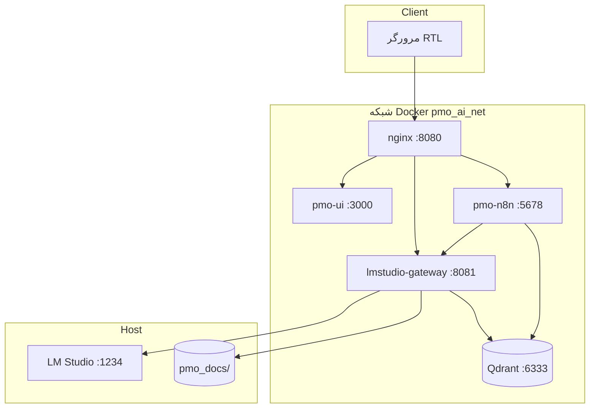
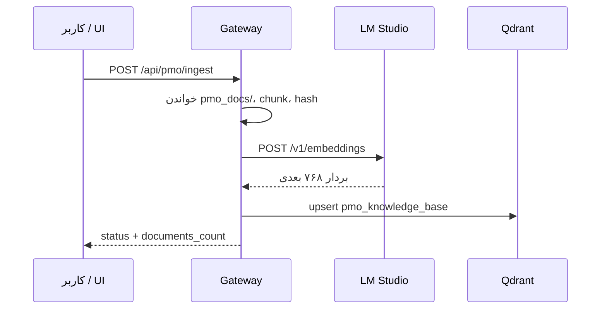

<div align="center">

[English](README.md) · **فارسی**


# PMO AI System

**اتوماسیون دانش PMO با zero-trust محلی — n8n + Qdrant + LM Studio Gateway + رابط فارسی RTL.**

[](.github/workflows/ci.yml)
[](LICENSE)
[](INSTALL.md)
[](https://lmstudio.ai)
[](Workflows/)
[](#خط-لوله-rag-و-اسناد)

`localhost:8080` · [نصب](docs/INSTALL_FA.md) · [معماری](docs/ARCHITECTURE.fa.md) · [ماتریس تست](docs/test_matrix.md) · [پذیرش](docs/ACCEPTANCE_CHECKLIST.md)

</div>

---

## فهرست مطالب

<details open>
<summary><strong>پرش به بخش</strong></summary>

- [PMO AI چیست؟](#pmo-ai-چیست)
- [چه چیزی نیست](#چه-چیزی-نیست)
- [چرا محلی / zero-trust](#چرا-محلی--zero-trust)
- [معماری](#معماری)
- [ویژگی‌های کلیدی](#ویژگی‌های-کلیدی)
- [شروع سریع](#شروع-سریع)
- [نصب](#نصب)
- [کاربرد و سناریوها](#کاربرد-و-سناریوها)
- [سطح API](#سطح-api)
- [خط لوله RAG و اسناد](#خط-لوله-rag-و-اسناد)
- [workflowهای n8n](#workflowهای-n8n)
- [پیکربندی (SSOT)](#پیکربندی-ssot)
- [ساختار مخزن](#ساختار-مخزن)
- [تست و دروازه کیفیت](#تست-و-دروازه-کیفیت)
- [استقرار آفلاین](#استقرار-آفلاین)
- [امنیت و air-gap](#امنیت-و-air-gap)
- [بنچمارک](#بنچمارک)
- [وضعیت و پذیرش](#وضعیت-و-پذیرش)
- [مستندات](#مستندات)
- [مشارکت](#مشارکت)
- [مجوز](#مجوز)

</details>

---

## PMO AI چیست؟

**PMO AI System** دستیار دفتر مدیریت پروژه روی سخت‌افزار شماست: دریافت اسناد فارسی/انگلیسی، گفتگو با RAG، تهیه نامه رسمی و تحلیل ریسک — **بدون** ارسال داده به APIهای ابری LLM.

| فیلد | جزئیات |
|------|--------|
| **نقطه ورود** | nginx `:8080` → داشبورد RTL + API |
| **استنتاج** | LM Studio روی میزبان `:1234` |
| **ارکستراسیون** | workflowهای n8n (ingest, letter, risk) |
| **ذخیره برداری** | Qdrant `pmo_knowledge_base` (۷۶۸ بعد، cosine) |
| **گیت‌وی** | FastAPI BFF — پروکسی OpenAI + API اختصاصی PMO |
| **SSOT پیکربندی** | [`config/models.yaml`](config/models.yaml) |

اتوماسیون دانش PMO آفلاین: **n8n + Qdrant + LM Studio Gateway + رابط فارسی**.

---

## چه چیزی نیست

| برداشت نادرست | واقعیت |
|---------------|--------|
| ❌ SaaS ابری PMO | ✅ استک Docker خودمیزبان |
| ❌ مونولیت تکی | ✅ nginx + UI + gateway + n8n + Qdrant |
| ❌ LLM همیشه آنلاین | ✅ فقط GGUF محلی LM Studio |
| ❌ UI فقط انگلیسی | ✅ داشبورد RTL فارسی؛ مستندات دوزبانه (انگلیسی مرجع) |
| ❌ جایگزین n8n | ✅ n8n موتور workflow؛ gateway نقش BFF دارد |

---

## چرا محلی / zero-trust

تیم‌های PMO دولتی و سازمانی اغلب نمی‌توانند قراردادها و گزارش‌های ریسک را به API شخص ثالث بفرستند. PMO AI:

1. **اسناد** را روی دیسک (`pmo_docs/`) و Qdrant محلی نگه می‌دارد
2. **استنتاج** را از LM Studio میزبان می‌گیرد
3. **منطق workflow** را به‌صورت JSON قابل ممیزی در `Workflows/` دارد
4. **احراز هویت** را با `X-PMO-Token` / `WEBHOOK_SECRET` اعمال می‌کند

---

## معماری

### استک (زمان اجرا)

```
Browser → nginx:8080 → pmo-ui | lmstudio-gateway:8081 | pmo-n8n:5678
lmstudio-gateway → LM Studio (host:1234)
pmo-n8n → gateway + qdrant:6333
```

### نمودار اجزا



### جریان داده — ingest RAG



### مدل‌ها (SSOT: `config/models.yaml`)

| نقش | شناسه مدل | توضیح |
|-----|-----------|-------|
| LLM | `gemma-4-e4b-it-ud` | گفتگو، نامه، ریسک |
| Embedding | `nomic-embed-text-v2` | ۷۶۸ بعد |

> ادعاهای مقاله برای Qwen 26B / nomic v1.5 با مدل‌های PoC بالا جایگزین شده‌اند.

---

## ویژگی‌های کلیدی

| ویژگی | شرح |
|-------|-----|
| **UI پنج‌تبه RTL** | گفتگو، نامه، ریسک، اسناد، تنظیمات |
| **گفتگوی استریم** | SSE + RAG اختیاری |
| **نامه رسمی** | تولید فارسی + دانلود DOCX |
| **تحلیل ریسک** | JSON ساختاریافته + جدول HTML |
| **ورود سند** | txt, docx, pdf (L1); md, csv, json (L2) |
| **API سازگار OpenAI** | `/v1/chat/completions`, `/v1/embeddings` |
| **تطابق n8n** | webhookها آینه سناریوهای gateway |
| **بسته آفلاین** | `build_bundle.ps1` → tarball تصاویر |
| **ماتریس تست** | ۴۲+ pytest، ۱۲+ Playwright، لایه live اختیاری |

---

## شروع سریع

```powershell
Copy-Item .env.example .env
.\scripts\setup_lmstudio.ps1
.\scripts\install.ps1
# مرورگر: http://localhost:8080
```

بررسی:

```powershell
.\scripts\preflight.ps1
.\scripts\test_gateway.ps1
```

---

## نصب

راهنمای کامل ۹ مرحله‌ای: **[docs/INSTALL_FA.md](docs/INSTALL_FA.md)**

انگلیسی: **[INSTALL.md](INSTALL.md)**

---

## کاربرد و سناریوها

### workflowهای UI

| تب | عمل |
|----|-----|
| **گفتگو** | پرسش؛ RAG برای پاسخ مبتنی بر سند |
| **نامه** | فرم یا free prompt → تولید → DOCX |
| **ریسک** | context یا گزارش‌های ingest شده |
| **اسناد** | آپلود، ingest، مشاهده manifest |
| **تنظیمات** | سلامت سرویس‌ها، شناسه مدل، webhook |

### دود آزمایشی

```powershell
.\scripts\run_poc.ps1
python scripts/benchmark_pmo.py
```

هدر لازم برای API:

```http
X-PMO-Token: <WEBHOOK_SECRET از .env>
```

---

## سطح API

### سلامت و پروکسی OpenAI

| متد | مسیر | احراز | هدف |
|-----|------|-------|-----|
| `GET` | `/health` | — | سلامت استک |
| `GET` | `/v1/models` | — | لیست مدل‌های LM Studio |
| `POST` | `/v1/chat/completions` | — | پروکسی گفتگو |
| `POST` | `/v1/embeddings` | — | پروکسی embedding |

### API اختصاصی PMO (توکن لازم)

| متد | مسیر | هدف |
|-----|------|-----|
| `GET` | `/api/pmo/status` | تعداد اسناد، مدل‌ها، آمادگی |
| `POST` | `/api/pmo/chat` | گفتگو (JSON) |
| `POST` | `/api/pmo/chat/stream` | گفتگو (SSE) |
| `POST` | `/api/pmo/letter` | تولید نامه فارسی |
| `POST` | `/api/pmo/letter/docx` | نامه به‌صورت DOCX |
| `POST` | `/api/pmo/risk/run` | تحلیل ریسک |
| `POST` | `/api/pmo/ingest` | ingest RAG از `pmo_docs/` |
| `GET` | `/api/pmo/documents/list` | لیست اسناد |
| `POST` | `/api/pmo/documents/upload` | آپلود دسته‌ای (حداکثر ۱۰ فایل) |
| `DELETE` | `/api/pmo/documents/{name}` | حذف سند |

---

## خط لوله RAG و اسناد

جزئیات: **[docs/DOCUMENT_IMPORT.md](docs/DOCUMENT_IMPORT.md)**

| سطح | پسوندها |
|-----|---------|
| L1 | `.txt`, `.docx`, `.pdf` |
| L2 | `.md`, `.csv`, `.json`, `.log`, `.text` |

**محدودیت:** ۳۰ مگابایت/فایل، ۱۰ فایل/دسته.

پس از ارتقا: یک‌بار `PMO_RAG_RESET=true`، ingest، سپس `false`.

---

## workflowهای n8n

| فایل | Webhook |
|------|---------|
| `01_rag_ingestion.json` | `POST /webhook/pmo/ingest` |
| `02_scenario_a_letter.json` | `POST /webhook/pmo/letter` |
| `03_scenario_b_risk.json` | `POST /webhook/pmo/risk` |

```powershell
.\scripts\bootstrap_n8n.ps1
python scripts/validate_workflow.py Workflows
```

فایل‌های قدیمی در [`archive/`](archive/) — در production استفاده نشود.

---

## پیکربندی (SSOT)

[`config/models.yaml`](config/models.yaml) — URL، شناسه مدل، chunk، webhook، Qdrant.

```powershell
python scripts/sync_config.py
```

پرامپت‌ها: [`config/prompts/`](config/prompts/)

---

## ساختار مخزن

| مسیر | نقش |
|------|-----|
| `services/lmstudio-gateway/` | پروکسی OpenAI + BFF |
| `services/pmo-ui/` | رابط RTL |
| `services/nginx/` | ورودی `:8080` |
| `Workflows/` | exportهای n8n (01/02/03) |
| `config/models.yaml` | منبع واحد حقیقت |
| `scripts/` | install, preflight, run_poc, benchmark |
| `tests/` | unit, integration, Playwright |
| `docs/` | معماری، نصب، پذیرش، ماتریس تست |
| `samples/` | نمونه قرارداد و گزارش |
| `archive/` | آرشیو قدیمی |

---

## تست و دروازه کیفیت

```powershell
python scripts/generate_fixtures.py
pip install -r services/lmstudio-gateway/requirements.txt `
            -r services/lmstudio-gateway/requirements-test.txt
python -m pytest tests/unit tests/integration -m "not live" -q

docker compose up -d --build
cd tests\playwright; npm install; npx playwright test --project=chrome

.\scripts\run_all_tests.ps1
.\scripts\run_all_tests.ps1 -Live
```

ماتریس کامل: **[docs/test_matrix.md](docs/test_matrix.md)**

**آخرین sign-off:** ۴۲ pytest (۷ live حذف‌شده)، ۱۲ Playwright.

---

## استقرار آفلاین

```powershell
.\scripts\build_bundle.ps1
```

`docker-compose.prod.yml` — تصاویر از پیش ساخته، بدون mount سورس gateway.

---

## امنت و air-gap

| کنترل | جزئیات |
|-------|--------|
| بدون LLM خروجی | gateway → فقط `LMSTUDIO_UPSTREAM` |
| توکن | `X-PMO-Token` روی `/api/pmo/*` |
| n8n localhost | `127.0.0.1:5678` |
| محافظت آپلود | رد `.exe`؛ محدودیت حجم/تعداد |
| رازها | `.env` در gitignore |

**[SECURITY.fa.md](SECURITY.fa.md)** · **[docs/ACCEPTANCE_CHECKLIST.md](docs/ACCEPTANCE_CHECKLIST.md)** (۴۰ مورد)

---

## بنچمارک

```powershell
python scripts/benchmark_pmo.py
```

زمان‌بندی به سخت‌افزار و LM Studio بستگی دارد — روی ماشین خودتان دوباره اجرا کنید.

---

## وضعیت و پذیرش

| حوزه | وضعیت |
|------|-------|
| استک ۵ سرویسه Docker | ✅ |
| API گیت‌وی PMO | ✅ |
| UI پنج‌تبه RTL | ✅ |
| workflowهای 01–03 | ✅ |
| آپلود + ingest | ✅ |
| CI (GitHub Actions) | ✅ |
| لایه live/golden | ⚙️ اختیاری |

---

## مستندات

| سند | محتوا |
|-----|-------|
| [`README.md`](README.md) | README انگلیسی (ساختار یکسان) |
| [`INSTALL.md`](INSTALL.md) / [`docs/INSTALL_FA.md`](docs/INSTALL_FA.md) | نصب |
| [`docs/ARCHITECTURE.md`](docs/ARCHITECTURE.md) / [`docs/ARCHITECTURE.fa.md`](docs/ARCHITECTURE.fa.md) | معماری |
| [`docs/DOCUMENT_IMPORT.md`](docs/DOCUMENT_IMPORT.md) | runbook ورود سند |
| [`docs/test_matrix.md`](docs/test_matrix.md) | لایه‌های تست |
| [`docs/ACCEPTANCE_CHECKLIST.md`](docs/ACCEPTANCE_CHECKLIST.md) | QA دستی ۴۰ موردی |
| [`CONTRIBUTING.fa.md`](CONTRIBUTING.fa.md) | مشارکت |
| [`SECURITY.fa.md`](SECURITY.fa.md) | امنیت |
| [`docs/README.fa.md`](docs/README.fa.md) | هاب مستندات فارسی |
| [`LICENSE`](LICENSE) | MIT |

---

## مشارکت

[`CONTRIBUTING.fa.md`](CONTRIBUTING.fa.md) ([English](CONTRIBUTING.md))

- تغییرات اتمیک و تست‌شده.
- انگلیسی زبان **مرجع** مستندات؛ `.fa.md` همان حقایق را منعکس کند.

---

## مجوز

MIT — [`LICENSE`](LICENSE)

---

**PMO AI System** — ساخته‌شده برای ماندن روی ماشین شما، نه فقط تبلیغ «هوش مصنوعی امن».

**زبان‌ها:** [English](README.md) · [فارسی](README.fa.md)
