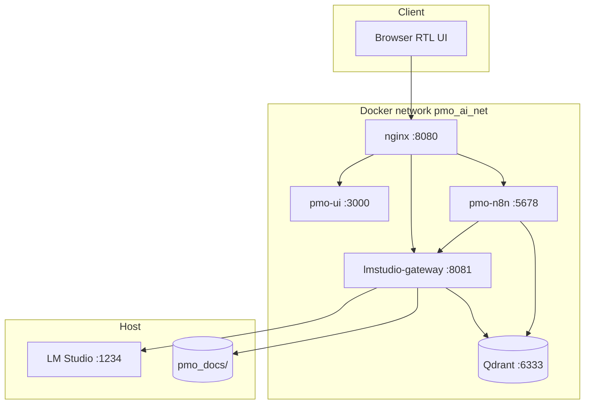
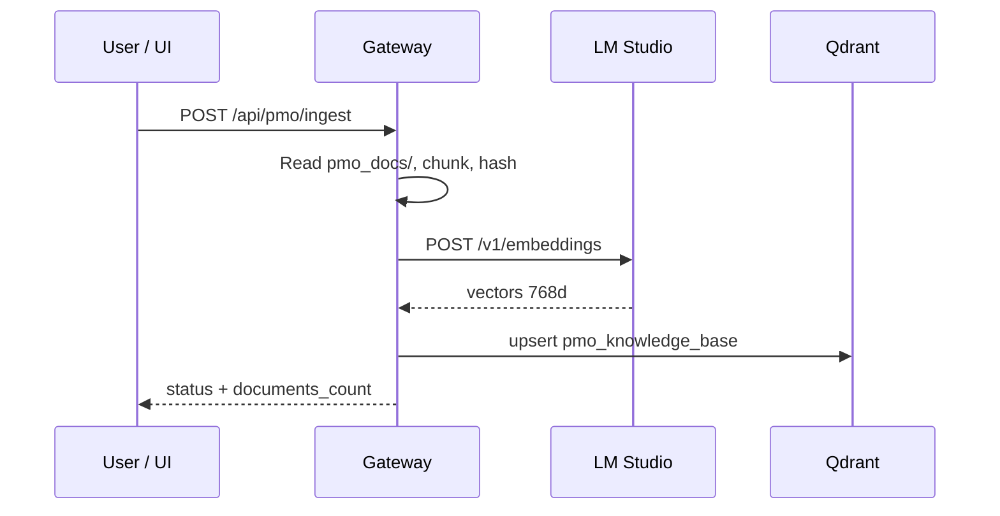

<div align="center">

**English** · [Persian](README.fa.md)


# PMO AI System

**Zero-trust, air-gapped PMO knowledge automation — n8n + Qdrant + LM Studio Gateway + Persian RTL UI.**

[](.github/workflows/ci.yml)
[](LICENSE)
[](INSTALL.md)
[](https://lmstudio.ai)
[](Workflows/)
[](#rag--document-pipeline)

`localhost:8080` · [Install](INSTALL.md) · [Architecture](docs/ARCHITECTURE.md) · [Test matrix](docs/test_matrix.md) · [Acceptance](docs/ACCEPTANCE_CHECKLIST.md)

</div>

---

## Table of Contents

<details open>
<summary><strong>Jump to section</strong></summary>

- [What is PMO AI?](#what-is-pmo-ai)
- [What it is NOT](#what-it-is-not)
- [Why local / zero-trust](#why-local--zero-trust)
- [Architecture](#architecture)
- [Feature highlights](#feature-highlights)
- [Quick start](#quick-start)
- [Installation](#installation)
- [Usage & scenarios](#usage--scenarios)
- [API surface](#api-surface)
- [RAG & document pipeline](#rag--document-pipeline)
- [n8n workflows](#n8n-workflows)
- [Configuration (SSOT)](#configuration-ssot)
- [Repository layout](#repository-layout)
- [Testing & quality gates](#testing--quality-gates)
- [Offline deployment](#offline-deployment)
- [Security & air-gap](#security--air-gap)
- [Benchmarks](#benchmarks)
- [Status & acceptance](#status--acceptance)
- [Documentation](#documentation)
- [Contributing](#contributing)
- [License](#license)

</details>

---

## What is PMO AI?

**PMO AI System** is an on-premise project-management-office assistant that runs entirely on your hardware: ingest Persian/English documents, chat with RAG, draft formal letters, and analyze project risks — without sending data to external LLM APIs.

| Field | Detail |
|-------|--------|
| **Entry point** | nginx `:8080` → RTL dashboard + API |
| **Inference** | LM Studio on host `:1234` (`gemma-4-e4b-it-ud` + `nomic-embed-text-v2`) |
| **Orchestration** | n8n workflows (ingest, letter, risk) |
| **Vector store** | Qdrant `pmo_knowledge_base` (768-dim cosine) |
| **Gateway** | FastAPI BFF — OpenAI-compatible proxy + PMO API |
| **Config SSOT** | [`config/models.yaml`](config/models.yaml) |

Air-gapped PMO knowledge automation: **n8n + Qdrant + LM Studio Gateway + Persian UI**.

---

## What it is NOT

| Misread | Reality |
|---------|---------|
| ❌ Cloud SaaS PMO | ✅ Self-hosted Docker stack on your machine |
| ❌ Single monolith | ✅ nginx + UI + gateway + n8n + Qdrant services |
| ❌ Always-online LLM | ✅ LM Studio local GGUF only — no outbound proxy |
| ❌ English-only UI | ✅ RTL Persian dashboard; docs bilingual (EN canonical) |
| ❌ Replace n8n | ✅ n8n remains workflow engine; gateway is BFF + direct API |

---

## Why local / zero-trust

Government and enterprise PMO teams often cannot ship contracts, risk registers, or weekly reports to third-party AI APIs. PMO AI keeps:

1. **Documents** on disk (`pmo_docs/`) and in local Qdrant
2. **Inference** on the host via LM Studio
3. **Workflow logic** auditable as n8n JSON exports in `Workflows/`
4. **Auth** enforced via `X-PMO-Token` / `WEBHOOK_SECRET`

---

## Architecture

### Stack (runtime)

```
Browser → nginx:8080 → pmo-ui | lmstudio-gateway:8081 | pmo-n8n:5678
lmstudio-gateway → LM Studio (host:1234)
pmo-n8n → gateway + qdrant:6333
```

### Component diagram



### Data flow — RAG ingest



### Models (SSOT: `config/models.yaml`)

| Role | Model ID | Notes |
|------|----------|-------|
| LLM | `gemma-4-e4b-it-ud` | Chat, letter, risk |
| Embedding | `nomic-embed-text-v2` | 768 dimensions |

> Article claims for Qwen 26B / nomic v1.5 are superseded by the PoC models above.

---

## Feature highlights

| Feature | Description |
|---------|-------------|
| **5-tab RTL UI** | Chat, Letter, Risk, Documents, Settings |
| **Streaming chat** | SSE stream + optional RAG context |
| **Formal letters** | Persian letter generation + DOCX download |
| **Risk analysis** | Structured JSON + HTML table from weekly reports |
| **Document import** | txt, docx, pdf (L1); md, csv, json (L2) |
| **OpenAI-compatible API** | `/v1/chat/completions`, `/v1/embeddings` |
| **n8n parity** | Webhooks mirror gateway scenarios |
| **Offline bundle** | `build_bundle.ps1` → transferable image tarballs |
| **Test matrix** | 42+ pytest, 12+ Playwright, optional live tier |

---

## Quick start

```powershell
Copy-Item .env.example .env
.\scripts\setup_lmstudio.ps1
.\scripts\install.ps1
# Open http://localhost:8080
```

Verify:

```powershell
.\scripts\preflight.ps1
.\scripts\test_gateway.ps1
```

---

## Installation

See **[INSTALL.md](INSTALL.md)** for the full 9-step guide (WSL2, Docker, LM Studio, models, `.env`, install, preflight).

Persian guide: **[docs/INSTALL_FA.md](docs/INSTALL_FA.md)**

---

## Usage & scenarios

### UI workflows

| Tab | Action |
|-----|--------|
| **Chat** | Ask questions; enable RAG for document-grounded answers |
| **Letter** | Fill recipient/subject or free prompt → generate → DOCX |
| **Risk** | Paste context or use ingested reports → risk table |
| **Docs** | Upload files, trigger ingest, view manifest |
| **Settings** | Service health, model IDs, webhook URLs |

### CLI / API smoke

```powershell
.\scripts\run_poc.ps1          # full E2E smoke
python scripts/benchmark_pmo.py # timing benchmarks → docs/
```

All PMO API routes require header:

```http
X-PMO-Token: <WEBHOOK_SECRET from .env>
```

---

## API surface

### Health & OpenAI proxy

| Method | Path | Auth | Purpose |
|--------|------|------|---------|
| `GET` | `/health` | — | Stack health (LM, Qdrant, n8n) |
| `GET` | `/v1/models` | — | List loaded LM Studio models |
| `POST` | `/v1/chat/completions` | — | OpenAI-compatible chat proxy |
| `POST` | `/v1/embeddings` | — | OpenAI-compatible embeddings |

### PMO API (token required)

| Method | Path | Purpose |
|--------|------|---------|
| `GET` | `/api/pmo/status` | Documents count, models, readiness |
| `POST` | `/api/pmo/chat` | Chat (JSON response) |
| `POST` | `/api/pmo/chat/stream` | Chat (SSE stream) |
| `POST` | `/api/pmo/letter` | Generate Persian letter |
| `POST` | `/api/pmo/letter/docx` | Letter as DOCX file |
| `POST` | `/api/pmo/risk/run` | Risk analysis |
| `POST` | `/api/pmo/ingest` | RAG ingest from `pmo_docs/` |
| `GET` | `/api/pmo/documents/list` | List uploaded documents |
| `POST` | `/api/pmo/documents/upload` | Upload batch (max 10 files) |
| `DELETE` | `/api/pmo/documents/{name}` | Remove document |

### n8n proxy routes

| Method | Path |
|--------|------|
| `POST` | `/api/pmo/n8n/ingest` |
| `POST` | `/api/pmo/n8n/letter` |
| `POST` | `/api/pmo/n8n/risk` |

---

## RAG & document pipeline

See **[docs/DOCUMENT_IMPORT.md](docs/DOCUMENT_IMPORT.md)** for formats, limits, and runbook.

| Tier | Extensions |
|------|------------|
| L1 | `.txt`, `.docx`, `.pdf` |
| L2 | `.md`, `.csv`, `.json`, `.log`, `.text` |

**Limits:** 30 MB per file, 10 files per upload batch.

**Observability:**

| Signal | Where |
|--------|-------|
| `documents_count`, `last_ingest_at` | `GET /api/pmo/status` |
| `embed_model`, `llm_model` | `/health` |
| `rag_min_score` | status (default `0.35`) |

After upgrade, set `PMO_RAG_RESET=true` once, run ingest, then revert to `false`.

---

## n8n workflows

| File | Webhook |
|------|---------|
| [`01_rag_ingestion.json`](Workflows/01_rag_ingestion.json) | `POST /webhook/pmo/ingest` |
| [`02_scenario_a_letter.json`](Workflows/02_scenario_a_letter.json) | `POST /webhook/pmo/letter` |
| [`03_scenario_b_risk.json`](Workflows/03_scenario_b_risk.json) | `POST /webhook/pmo/risk` |

Bootstrap after install:

```powershell
.\scripts\bootstrap_n8n.ps1
```

Validate exports:

```powershell
python scripts/validate_workflow.py Workflows
```

Legacy workflows archived under [`archive/`](archive/) — do not use in production.

---

## Configuration (SSOT)

[`config/models.yaml`](config/models.yaml) drives:

- LM Studio upstream URL
- LLM and embedding model IDs
- RAG chunk size / overlap
- Webhook paths
- Qdrant collection name

Sync to `.env`:

```powershell
python scripts/sync_config.py
```

Prompts: [`config/prompts/`](config/prompts/) (`chat_system.txt`, `scenario_a_legal.txt`, `scenario_b_risk.txt`)

---

## Repository layout

| Path | Role |
|------|------|
| [`services/lmstudio-gateway/`](services/lmstudio-gateway/) | OpenAI proxy + BFF (from pc_client patterns) |
| [`services/pmo-ui/`](services/pmo-ui/) | RTL web UI |
| [`services/nginx/`](services/nginx/) | Entry `:8080` |
| [`Workflows/`](Workflows/) | n8n exports (01/02/03) |
| [`config/models.yaml`](config/models.yaml) | Single source of truth |
| [`scripts/`](scripts/) | install, preflight, run_poc, benchmark |
| [`tests/`](tests/) | unit, integration, Playwright |
| [`docs/`](docs/) | architecture, install, acceptance, test matrix |
| [`samples/`](samples/) | contract clause, weekly report fixtures |
| [`archive/`](archive/) | Legacy files (archived) |

---

## Testing & quality gates

```powershell
# Tier 0 — no LM, no live stack (CI default)
python scripts/generate_fixtures.py
pip install -r services/lmstudio-gateway/requirements.txt `
            -r services/lmstudio-gateway/requirements-test.txt
python -m pytest tests/unit tests/integration -m "not live" -q

# Tier 2 — Playwright (stack on :8080)
docker compose up -d --build
cd tests\playwright; npm install; npx playwright test --project=chrome

# Unified runner
.\scripts\run_all_tests.ps1          # tier 0–2
.\scripts\run_all_tests.ps1 -Live  # + LM Studio live + golden
```

| Tier | Scope | Requires |
|------|-------|----------|
| 0 | Unit + API matrix (mocked LM) | Python only |
| 1 | Integration + n8n parity | Optional stack |
| 2 | Playwright UI | Docker + Chrome |
| 3 | Live + golden | LM Studio :1234 |

Full matrix: **[docs/test_matrix.md](docs/test_matrix.md)**

**Last sign-off:** 42 pytest passed (7 live deselected), 12 Playwright passed.

---

## Offline deployment

```powershell
.\scripts\build_bundle.ps1
# Produces pmo-offline-bundle/ with:
#   images/*.tar, docker-compose.prod.yml, scripts/, samples/
```

Production compose (`docker-compose.prod.yml`) uses pre-built images — no gateway source mounts.

---

## Security & air-gap

| Control | Detail |
|---------|--------|
| No outbound LLM | Gateway → `LMSTUDIO_UPSTREAM` only |
| Token auth | `X-PMO-Token` on `/api/pmo/*` |
| n8n localhost | `127.0.0.1:5678` in dev |
| Upload guard | Reject `.exe`; size/batch limits |
| Secrets | `.env` gitignored — rotate defaults before prod |

See **[SECURITY.md](SECURITY.md)** · **[docs/ACCEPTANCE_CHECKLIST.md](docs/ACCEPTANCE_CHECKLIST.md)** (40 items)

---

## Benchmarks

```powershell
python scripts/benchmark_pmo.py
# Writes docs/benchmark_raw.csv + docs/benchmark_results.md
```

Re-run on your hardware before trusting latency numbers — LM Studio throughput varies by GPU/CPU.

---

## Status & acceptance

| Area | Status |
|------|--------|
| Docker 5-service stack | ✅ Shipping |
| Gateway PMO API | ✅ Shipping |
| RTL 5-tab UI | ✅ Shipping |
| n8n workflows 01–03 | ✅ Shipping |
| Document upload + ingest | ✅ Shipping |
| CI (validate + pytest + docker build) | ✅ GitHub Actions |
| Live / golden tier | ⚙️ Optional (`-Live`) |

Run **[docs/ACCEPTANCE_CHECKLIST.md](docs/ACCEPTANCE_CHECKLIST.md)** after `install.ps1` for manual sign-off.

---

## Documentation

| Document | Contents |
|----------|----------|
| [`README.fa.md`](README.fa.md) | Persian README (same structure) |
| [`INSTALL.md`](INSTALL.md) / [`docs/INSTALL_FA.md`](docs/INSTALL_FA.md) | Installation |
| [`docs/ARCHITECTURE.md`](docs/ARCHITECTURE.md) / [`docs/ARCHITECTURE.fa.md`](docs/ARCHITECTURE.fa.md) | Stack & models |
| [`docs/DOCUMENT_IMPORT.md`](docs/DOCUMENT_IMPORT.md) | Import runbook |
| [`docs/test_matrix.md`](docs/test_matrix.md) | Automated test tiers |
| [`docs/ACCEPTANCE_CHECKLIST.md`](docs/ACCEPTANCE_CHECKLIST.md) | 40-item manual QA |
| [`docs/ARTICLE_APPENDIX.md`](docs/ARTICLE_APPENDIX.md) | Research article mapping |
| [`CONTRIBUTING.md`](CONTRIBUTING.md) / [`CONTRIBUTING.fa.md`](CONTRIBUTING.fa.md) | Contribute |
| [`SECURITY.md`](SECURITY.md) / [`SECURITY.fa.md`](SECURITY.fa.md) | Security policy |
| [`docs/README.md`](docs/README.md) | Docs hub (EN) |
| [`LICENSE`](LICENSE) | MIT |

---

## Contributing

See [`CONTRIBUTING.md`](CONTRIBUTING.md) ([فارسی](CONTRIBUTING.fa.md)).

- Keep changes atomic and tested (`pytest -m "not live"`).
- English is the **canonical** docs language; Persian `.fa.md` companions track the same facts.
- Model IDs live only in `config/models.yaml`.

---

## License

MIT — see [`LICENSE`](LICENSE).

---

**PMO AI System** — built to stay on your machine, not merely advertised as "secure AI."

**Languages:** [English](README.md) · [فارسی](README.fa.md)
